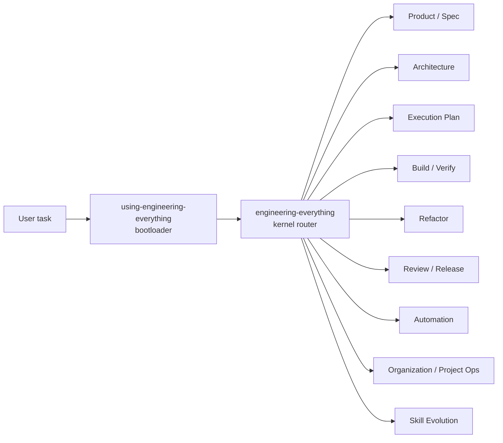

# Engineering Everything（工程化万物）

用工程思维路由创造型任务：先判断需求、架构、执行、验证、发布和沉淀路径，再让 agent 动手。

- 当前版本：`0.12.0`
- Package ID：`engineering-everything`
- License：`UNLICENSED`

## What It Is

Engineering Everything 是一个 plugin-first Skill library。它不是单个大 prompt，也不是把所有规则塞进一个入口；运行时入口只在 `skills/*/SKILL.md` 下：

- `$using-engineering-everything`：推荐入口，负责新会话、resume、任务切换和进入主路由前的 bootloader 判断。
- `$engineering-everything`：直达主路由，负责工程路由、阶段判断、项目形态判断和子 Skill 选择。
- `engineering-*` 子 Skill：分别处理产品定义、架构、执行规划、构建验证、重构、review/release、自动化、组织系统、项目接手和 Skill 自进化。

它解决的问题很直接：agent 不应该在需求未清、数据源未明、验证门禁不存在、旧项目未盘点时就开始写代码或搭架构。

## Quick Start

```bash
git clone https://github.com/HaodiFan/engineering-everything.git
cd engineering-everything
python3 scripts/install.py --target codex
```

新会话中使用：

```text
$using-engineering-everything

我想做一个电商管理系统。先判断工程路由，再告诉我现在应该先问什么、选什么、写什么。
```

已明确要直达主路由时：

```text
$engineering-everything

review 这个 PR，判断能不能 merge。
```

## How It Routes



路由事实源是 `data/routes.yaml`。输出契约事实源是 `references/output-contracts.md`。不要在 README 或 Skill 正文里维护第二套路由表或输出模板。

## Common Entrypoints

| 你要做什么 | 推荐入口 | 命中能力 |
|---|---|---|
| 模糊想法、需求、PRD | `/spec` `/define` | `engineering-product-definition` |
| 技术栈、架构、从 0 搭项目 | `/arch` `/new-project` | `engineering-architecture-design` |
| 接手旧项目、代码盘点 | `/handover` `/audit` | `engineering-project-inheritance` |
| 功能拆解、implementation plan | `/plan` `/split` | `engineering-execution-planning` |
| 实现、修 bug、迁移 | `/build` `/fix` | `engineering-build-verify` |
| 重构、清理、模块化 | `/refactor` `/cleanup` | `engineering-refactoring` |
| 测试、review、release | `/test` `/review` `/ship` | `engineering-review-release` |
| RPA、OCR、CV、LLM、数据自动化 | `/automation` `/rpa` `/ocr` `/llm` | `engineering-automation-playbooks` |
| 面试、入职、组织、SOP、非软件项目 | `/interview` `/onboard` `/org` `/estimate` | `engineering-organization-systems` |
| lesson、pattern、自进化 | `/learn` `/lesson` `/self-evolve` | `engineering-skill-evolution` |

用户说“不对 / 不是 / 这部分好乱 / 你没有参考”时，不默认切到 `/learn`。agent 必须先修正当前任务，再询问是否创建 GitHub lesson issue。

## Expected Output

规划类输出至少要回答：

- `工程路由`
- `当前阶段`
- `项目形态`
- `参考依据`
- `缺失内容`
- `下一步 3 个动作`
- `验证门禁`
- `停止条件`

执行类收尾必须说明：变更文件、已运行验证、未运行检查及原因、剩余风险。完整模板见 `references/output-contracts.md`。

## Installation

默认安装到 Codex：

```bash
python3 scripts/install.py --target codex
```

安装到本地 Agents：

```bash
python3 scripts/install.py --target agents
```

同时安装到两边：

```bash
python3 scripts/install.py --target both
```

查看、重建 symlink、卸载：

```bash
python3 scripts/install.py list --target both
python3 scripts/install.py relink --target both
python3 scripts/install.py uninstall --target both
```

安装后会把每个 runtime skill 链接到对应 `skills/*` 子目录，例如：

- `~/.codex/skills/using-engineering-everything`
- `~/.codex/skills/engineering-everything`
- `~/.codex/skills/engineering-project-inheritance`
- `~/.agents/skills/using-engineering-everything`
- `~/.agents/skills/engineering-everything`
- `~/.agents/skills/engineering-project-inheritance`

旧式整包安装已经退役；`--layout legacy` 会被拒绝。当前结构是 plugin-first / library layout，运行时入口只来自 `skills/*/SKILL.md`。

## Repository Layout

```text
engineering-everything/
├── .codex-plugin/
│   └── plugin.json
├── agents/
│   └── openai.yaml
├── data/
│   ├── routes.yaml
│   └── reference_distribution.yaml
├── docs/
│   ├── testing.md
│   └── designs/
├── evals/
│   └── scenarios/
├── references/
├── scripts/
└── skills/
    ├── using-engineering-everything/
    ├── engineering-everything/
    ├── engineering-project-inheritance/
    └── engineering-*/
```

Key files:

| File | Purpose |
|---|---|
| `.codex-plugin/plugin.json` | Plugin manifest；声明 `"skills": "./skills/"`，也是 package version 事实源。 |
| `skills/using-engineering-everything/SKILL.md` | Bootloader entrypoint. |
| `skills/engineering-everything/SKILL.md` | Kernel router entrypoint. |
| `skills/engineering-project-inheritance/SKILL.md` | 旧项目接手、盘点、继续迭代入口。 |
| `data/routes.yaml` | Machine-readable route contract. |
| `data/reference_distribution.yaml` | Root reference 到 runtime reference 副本的分发事实源。 |
| `references/output-contracts.md` | 规划、执行、review、eval 输出契约。 |
| `references/psps-framework.md` | Persona / Scenario / Pain / Solution Surface 框架。 |
| `references/refactoring-rules.md` | 行为保持型重构规则。 |
| `references/self-evolution-harness.md` | Lesson issue、pattern、自进化和发布门禁。 |
| `evals/scenarios/*.md` | 行为 eval 场景。 |
| `docs/testing.md` | 本地验证和 release gate 说明。 |

## Tooling

| Script | Purpose |
|---|---|
| `scripts/install.py` | 安装、relink、uninstall、list runtime skills。 |
| `scripts/skill_doctor.py` | 检查 plugin/library contract、route、reference、eval、README 和版本一致性。 |
| `scripts/sync_references.py` | 检查 root reference 与 runtime copies 是否 drift。 |
| `scripts/eval_scenarios.py` | 校验行为 eval scenario schema。 |
| `scripts/self_evolve.py` | 检查自进化 harness、GitHub/source contract 和安装副本。 |
| `scripts/lesson.py` | 校验 lesson/pattern 结构。 |

常用验证：

```bash
python3 scripts/skill_doctor.py --json
python3 scripts/self_evolve.py check --json
python3 scripts/eval_scenarios.py validate --json
python3 scripts/sync_references.py --check --json
python3 -m unittest discover -s tests
```

## Development Rules

- 不写第二套路由事实源：改路由先改 `data/routes.yaml`。
- 不复制输出模板：完整模板只放在 `references/output-contracts.md`。
- 不手改 runtime reference copy：先改 root `references/`，再用 `data/reference_distribution.yaml` 和 `scripts/sync_references.py` 检查。
- 改 Skill、route、reference、install 或 release contract 后，至少跑 `scripts/skill_doctor.py` 和 `scripts/self_evolve.py check`。
- 涉及 GitHub issue、push、tag、release 时，加跑 `scripts/self_evolve.py doctor`。

## Status

- 当前版本：`0.12.0`
- GitHub repo：`HaodiFan/engineering-everything`
- Runtime layout：plugin-first, `skills/*/SKILL.md`
- Recommended next release after root demotion：`v0.13.0`
- License：`UNLICENSED`

## Uninstall

```bash
python3 scripts/install.py uninstall --target both
```

或手动删除：

```bash
rm -rf ~/.codex/skills/using-engineering-everything
rm -rf ~/.codex/skills/engineering-everything
rm -rf ~/.agents/skills/using-engineering-everything
rm -rf ~/.agents/skills/engineering-everything
```

卸载只删除 runtime skill 链接或副本，不会删除你在项目中创建的代码、文档或业务产物。
